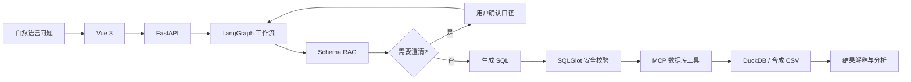

# 衡析 · 企业经营数据智能查询与分析平台

衡析是面向企业经营分析场景的自然语言问数应用。用户可以用自然语言提出数据问题，系统完成 Schema 检索、必要的业务口径澄清、SQL 生成与安全执行，并返回表格、结果说明、图表配置或分析报告。

> 当前版本使用仓库内的合成数据进行本地演示与评测，不应直接连接生产或敏感数据库。

## 核心能力

- **Schema RAG**：使用 BM25、1,024 维 Embedding、RRF 与 Rerank 检索相关字段，并根据表关系生成 Schema 图。
- **Agent 工作流**：通过 LangGraph 编排请求预处理、意图路由、数据库查询和已有结果分析。
- **Human-in-the-loop**：当“最好”“最重要”等问题缺少排名指标时暂停执行，用户补充口径后恢复工作流。
- **安全执行与修复**：通过 SQLGlot 限制只读单语句、`SELECT *`、未知表和越权表；对可恢复的 SQL 错误最多修复一次。
- **结果分析**：支持结果表格、SQL 查看、Excel 导出、自然语言解释、图表配置和分析报告。

## 工作流程



技术栈：**Python、FastAPI、Vue 3、LangGraph、Qwen、MCP、DuckDB、SQLGlot**。

## 评测结果

固定评测集包含两套合成数据库、30 道明确查询和 10 道口径模糊问题，覆盖聚合、时间过滤、比例计算及两至四表关联。

| 指标 | 结果 |
| --- | ---: |
| 必需 Schema 字段召回率 | **96.0%（120/125）** |
| 完整 Schema 召回率 | **83.3%（25/30）** |
| SQL 执行成功率 | **100%（30/30）** |
| 严格结果一致率 | **80.0%（24/30）** |
| 澄清召回率 / 精确率 | **100%（10/10）/ 100%（10/10）** |
| 端到端延迟 | **P50 29.48s / P95 51.00s** |
| 后端自动化测试 | **71/71 通过** |

“严格结果一致”要求模型结果与人工标准 SQL 的行列结构和数值一致；SQL 能够执行不代表业务结果一定正确。详细方法和失败分析见[评测报告](backend/evaluation/REPORT-v2.md)，原始记录见[extended-final.json](backend/evaluation/results/extended-final.json)。

## 快速启动

环境要求：Python 3.11、Node.js 20.19+、npm，以及可用的阿里云百炼模型额度。

### 1. 启动后端

```bash
cd backend
python3.11 -m venv .venv
./.venv/bin/python -m pip install -r requirements.txt
cp .env.example .env
```

在 `backend/.env` 中填写自己的 `LLM_API_KEY`。不要提交 `.env` 或将 API Key 写入前端。

```bash
./.venv/bin/python run.py
```

### 2. 启动前端

```bash
cd frontend
npm install
npm run dev
```

打开 `http://127.0.0.1:5173`。首次查询会构建 Schema 向量索引，可能产生少量模型调用费用。

### 3. 演示账号

| 账号 | 密码 | 数据范围 |
| --- | --- | --- |
| `sales` | `sales123` | 电商经营数据 |
| `mock` | `mock123` | 基础销售数据 |
| `admin` | `admin123` | 全部演示数据 |

可从以下问题开始：

- `按地区统计2026年8月销售额`
- `按客户等级统计2026年8月销售额`
- `查询2026年8月表现最好的客户`

## 测试

```bash
cd backend
./.venv/bin/python -m pytest -q
```

## 当前边界

- 数据均为合成数据，尚未验证真实企业数据、高并发负载或生产部署。
- 困难查询的严格结果一致率低于简单和中等查询，重要结论仍应检查 SQL、时间范围和指标口径。
- DuckDB 用于本地只读分析；生产接入应通过只读账号、权限隔离或企业数据仓库完成。
